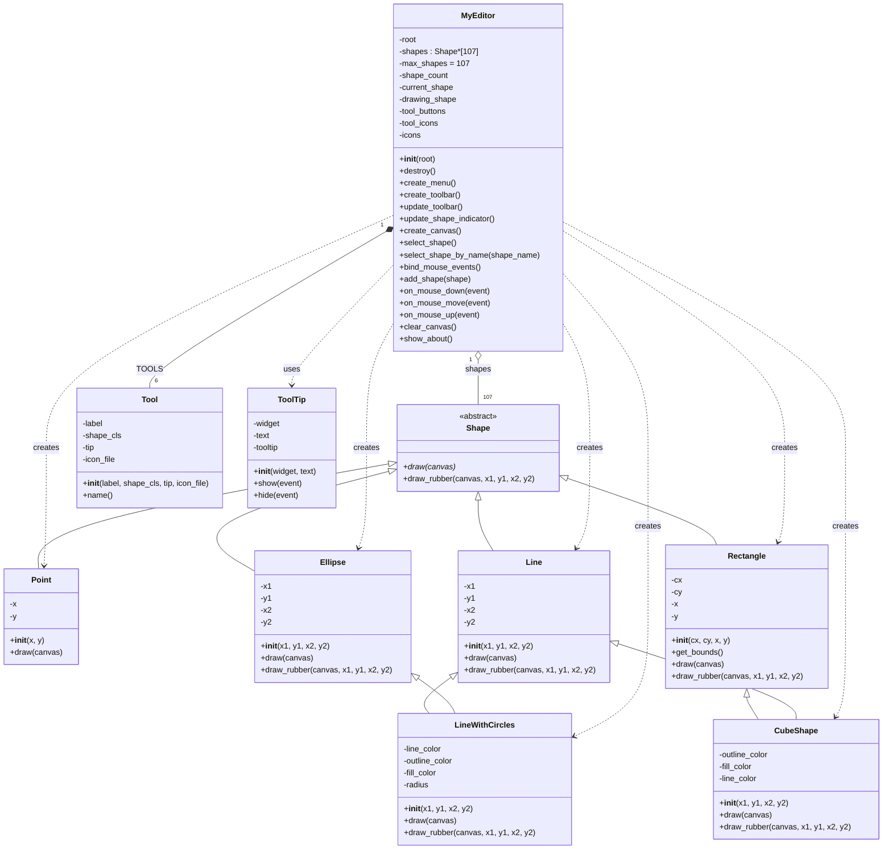

```mermaid

classDiagram
    direction TB

    class Shape {
        <<abstract>>
        +draw(canvas)*
        +draw_rubber(canvas, x1, y1, x2, y2)
    }

    class Point {
        -x
        -y
        +__init__(x, y)
        +draw(canvas)
    }

    class Line {
        -x1
        -y1
        -x2
        -y2
        +__init__(x1, y1, x2, y2)
        +draw(canvas)
        +draw_rubber(canvas, x1, y1, x2, y2)
    }

    class Rectangle {
        -cx
        -cy
        -x
        -y
        +__init__(cx, cy, x, y)
        +get_bounds()
        +draw(canvas)
        +draw_rubber(canvas, x1, y1, x2, y2)
    }

    class Ellipse {
        -x1
        -y1
        -x2
        -y2
        +__init__(x1, y1, x2, y2)
        +draw(canvas)
        +draw_rubber(canvas, x1, y1, x2, y2)
    }

    class LineWithCircles {
        -line_color
        -outline_color
        -fill_color
        -radius
        +__init__(x1, y1, x2, y2)
        +draw(canvas)
        +draw_rubber(canvas, x1, y1, x2, y2)
    }

    class CubeShape {
        -outline_color
        -fill_color
        -line_color
        +__init__(x1, y1, x2, y2)
        +draw(canvas)
        +draw_rubber(canvas, x1, y1, x2, y2)
    }

    class MyEditor {
        -root
        -shapes : Shape*[107]
        -max_shapes = 107
        -shape_count
        -current_shape
        -drawing_shape
        -tool_buttons
        -tool_icons
        -icons
        +__init__(root)
        +destroy()
        +create_menu()
        +create_toolbar()
        +update_toolbar()
        +update_shape_indicator()
        +create_canvas()
        +select_shape()
        +select_shape_by_name(shape_name)
        +bind_mouse_events()
        +add_shape(shape)
        +on_mouse_down(event)
        +on_mouse_move(event)
        +on_mouse_up(event)
        +clear_canvas()
        +show_about()
    }

    class Tool {
        -label
        -shape_cls
        -tip
        -icon_file
        +__init__(label, shape_cls, tip, icon_file)
        +name()
    }

    class ToolTip {
        -widget
        -text
        -tooltip
        +__init__(widget, text)
        +show(event)
        +hide(event)
    }

    Shape <|-- Point
    Shape <|-- Line
    Shape <|-- Rectangle
    Shape <|-- Ellipse
    Line <|-- LineWithCircles
    Ellipse <|-- LineWithCircles
    Rectangle <|-- CubeShape
    Line <|-- CubeShape

    MyEditor "1" o-- "107" Shape : shapes
    MyEditor "1" *-- "6" Tool : TOOLS
    MyEditor ..> Point : creates
    MyEditor ..> Line : creates
    MyEditor ..> Rectangle : creates
    MyEditor ..> Ellipse : creates
    MyEditor ..> LineWithCircles : creates
    MyEditor ..> CubeShape : creates
    MyEditor ..> ToolTip : uses
```
