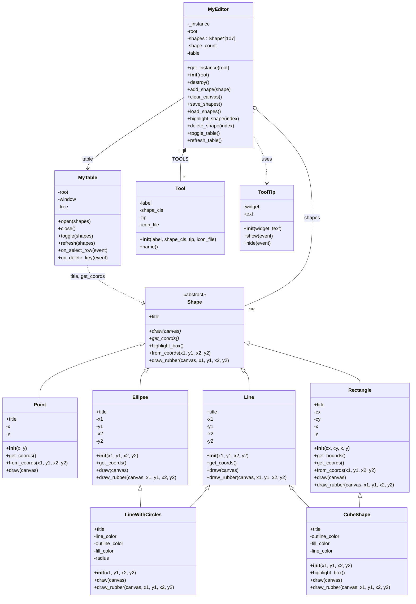

```mermaid

classDiagram
    direction TB

    class Shape {
        <<abstract>>
        +title
        +draw(canvas)*
        +get_coords()*
        +highlight_box()
        +from_coords(x1, y1, x2, y2)
        +draw_rubber(canvas, x1, y1, x2, y2)
    }

    class Point {
        +title
        -x
        -y
        +__init__(x, y)
        +get_coords()
        +from_coords(x1, y1, x2, y2)
        +draw(canvas)
    }

    class Line {
        +title
        -x1
        -y1
        -x2
        -y2
        +__init__(x1, y1, x2, y2)
        +get_coords()
        +draw(canvas)
        +draw_rubber(canvas, x1, y1, x2, y2)
    }

    class Rectangle {
        +title
        -cx
        -cy
        -x
        -y
        +__init__(cx, cy, x, y)
        +get_bounds()
        +get_coords()
        +from_coords(x1, y1, x2, y2)
        +draw(canvas)
        +draw_rubber(canvas, x1, y1, x2, y2)
    }

    class Ellipse {
        +title
        -x1
        -y1
        -x2
        -y2
        +__init__(x1, y1, x2, y2)
        +get_coords()
        +draw(canvas)
        +draw_rubber(canvas, x1, y1, x2, y2)
    }

    class LineWithCircles {
        +title
        -line_color
        -outline_color
        -fill_color
        -radius
        +__init__(x1, y1, x2, y2)
        +draw(canvas)
        +draw_rubber(canvas, x1, y1, x2, y2)
    }

    class CubeShape {
        +title
        -outline_color
        -fill_color
        -line_color
        +__init__(x1, y1, x2, y2)
        +highlight_box()
        +draw(canvas)
        +draw_rubber(canvas, x1, y1, x2, y2)
    }

    class MyEditor {
        -_instance
        -root
        -shapes : Shape*[107]
        -shape_count
        -table
        +get_instance(root)
        +__init__(root)
        +destroy()
        +add_shape(shape)
        +clear_canvas()
        +save_shapes()
        +load_shapes()
        +highlight_shape(index)
        +delete_shape(index)
        +toggle_table()
        +refresh_table()
    }

    class MyTable {
        -root
        -window
        -tree
        +open(shapes)
        +close()
        +toggle(shapes)
        +refresh(shapes)
        +on_select_row(event)
        +on_delete_key(event)
    }

    class Tool {
        -label
        -shape_cls
        -tip
        -icon_file
        +__init__(label, shape_cls, tip, icon_file)
        +name()
    }

    class ToolTip {
        -widget
        -text
        +__init__(widget, text)
        +show(event)
        +hide(event)
    }

    Shape <|-- Point
    Shape <|-- Line
    Shape <|-- Rectangle
    Shape <|-- Ellipse
    Line <|-- LineWithCircles
    Ellipse <|-- LineWithCircles
    Rectangle <|-- CubeShape
    Line <|-- CubeShape

    MyEditor "1" o-- "107" Shape : shapes
    MyEditor "1" *-- "6" Tool : TOOLS
    MyEditor --> MyTable : table
    MyTable ..> Shape : title, get_coords
    MyEditor ..> ToolTip : uses

```
